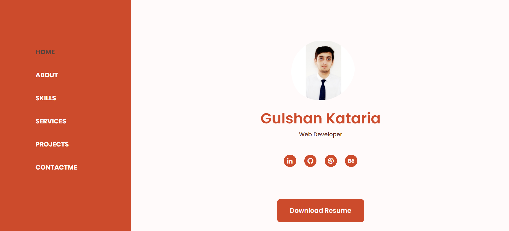

                                                      **     Hello my dear Frinds!! ⚡️ **
                                                          I love making connections !! 
                                                      Connect with me :  

>                                                         
>

> h                                               ttps://gulshankataria.github.io/GulshanKataria/

### Website Preview

 
  <kbd>
    
  </kbd>

:star: Star me on GitHub — it helps!

## Features 📋
⚡️ Fully Responsive\
⚡️ Valid HTML5 & CSS3\
⚡️ Very Easy to modify

## Installation & Deployment 📦
- Clone the repository and modify the content of <b>index.html</b> according to your requirement.
- Add or remove images from `assets/img/` directory as per your requirement.
- I highly recommend to use [Github Pages](https://create-react-app.dev/docs/deployment/#github-pages) to deploy the website the EASIEST WAY.
- To deploy your website, first you need to create github repository with name `<your-github-username>.github.io`. Please don't give any other name.
- Push the generated code to the `master` branch of this repository.

## Sections 📚
✔️ Home \
✔️ About \
✔️ Skills \
✔️ Services \
✔️ Projects \
✔️ Contact me\
✔️ Resume

## Tools Used 🛠️
* [<b>GitHub Pages</b>](https://create-react-app.dev/docs/deployment/#github-pages) - To host my static website (HTML, CSS, JS).
* [<b>Materialize</b>](https://materializecss.com/) - A CSS framework to get Google's Material Design components.
* [<b>Typed.js</b>](https://mattboldt.com/demos/typed-js/) - JavaScript Library

## Contributing 💡
#### Step 1

- **Option 1**
    - 🍴 Fork this repo!

- **Option 2**
    - 👯 Clone this repo to your local machine.

#### Step 2

- **Build your code** 🔨🔨🔨

#### Step 3

-  Create a new pull request.
